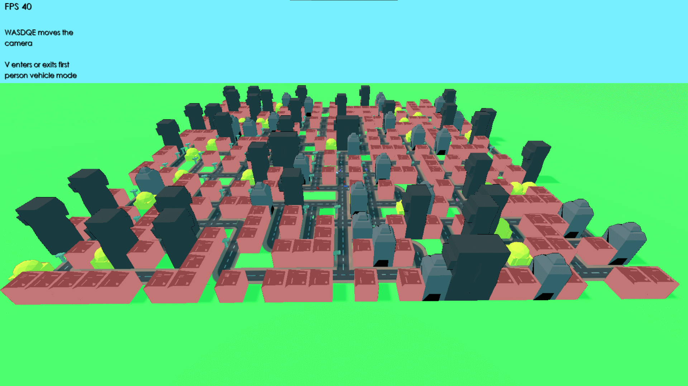
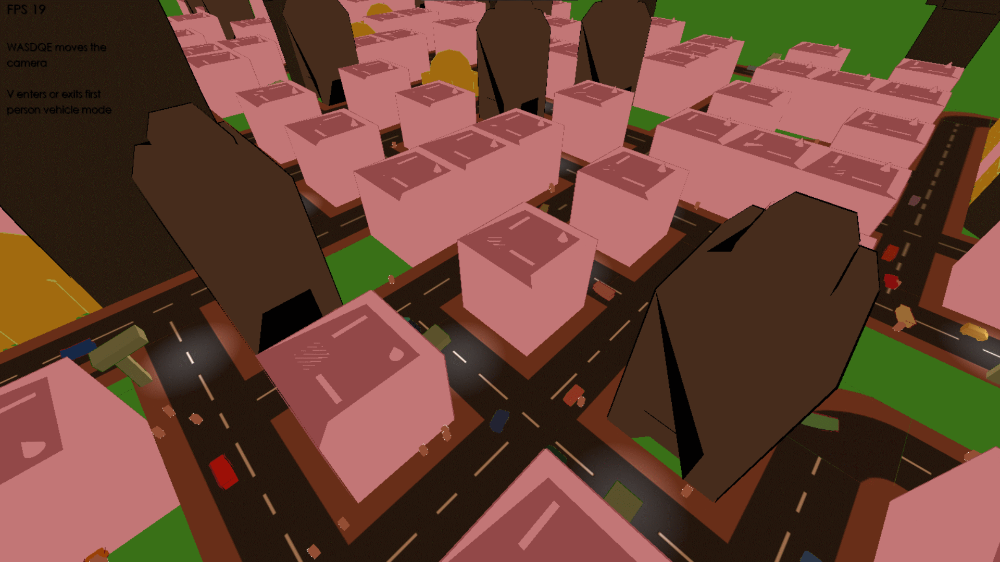
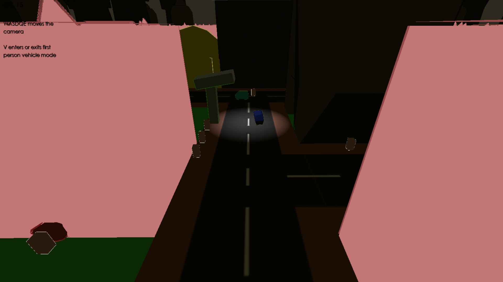
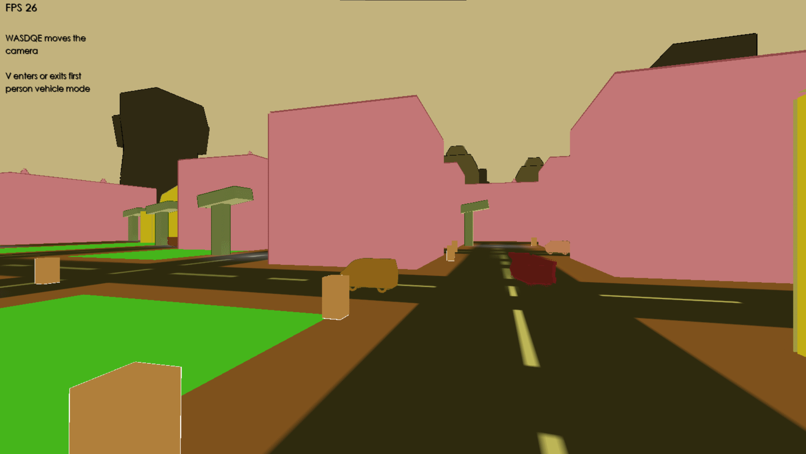

# My city driving simulator

Name: Alex Nuzum

Student Number: C19307776

Class Group: TU856

# Description

For this project I wanted to create a a simulation of city life. I wanted to have cars that travel around on the streets and people that walk around on the sidewalk. In this simulation, cars and people travel round the city, stopping when they are about run into each other.

## Video

## How it works

I found a road generation algorithm [here](https://kidscancode.org/blog/2018/09/godot3_procgen2/) which I adapted to work in 3d. It was originally programmed to work with 2D tiles. I created all the road textures myself. I also created all the building and vehicle models myself in blender. I also filled all non-road squares with buildings

I created a path generation algorithm. Cars and people then seek the nearest target in a list of targets. I check if the road at an xz position is of a certain type and determine where the car or person will move next. I do this 10000 times in a loop for every car as they are placed in the scene. This generates a path that each car will travel throughout the simulation.

The path generation algorithm also determines which side of the road cars will be on based on which direction they are moving. Cars drive on the left side of the road much like our own road laws.

The people use the same algorithm with the only difference being that people are offset from the center of the road by 0.9 units as the places them on the footpath.

Both people and cars stop/slow down when they are about to run into other people or cars. I originally wanted to have cars properly stop and wait for others to take turns / cross in front etc. but I couldn't figure out how to get this to fully work.

Lastly, I added a first person driving mode. When the player presses V, the camera will toggle between following a random car allowing the player to move the camera themselves.

## Screenshots

---

# Analysis
Though the algorithms behind boids' movments are quite simple, the emerging behaviour gives the illusion that the cars and people are navigating the city on their own.